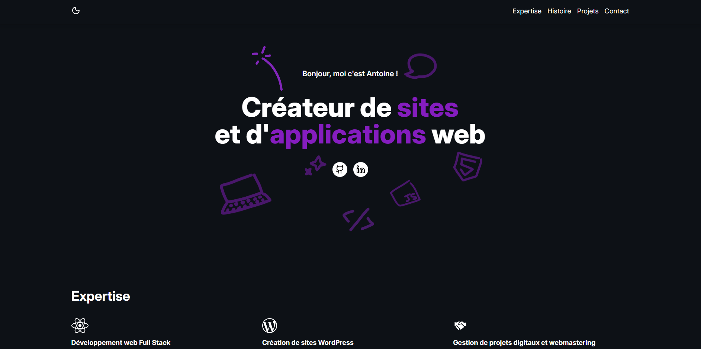

# Personal Portfolio - Antoine Koekelkoren

[]()

A modern personal portfolio built with React and Vite, showcasing my technical skills, professional journey, and personal projects. The site features a responsive design with dark/light mode switching, smooth animations, and an integrated contact form with EmailJS.

## ✨ Features

- **Responsive Design:** Optimized for desktop, tablet, and mobile devices.
- **Dark/Light Mode:** Automatic theme switching based on system preferences with manual toggle.
- **Smooth Navigation:** Seamless scrolling between sections with animated transitions.
- **Interactive Timeline:** Professional career history with visual timeline component.
- **Contact Form:** Integrated EmailJS for direct email communication.
- **CSS Animations:** Floating elements and entrance animations for enhanced UX.
- **Project Showcase:** Interactive grid displaying personal projects with hover effects.
- **Social Integration:** Direct links to GitHub and LinkedIn profiles.

## 🛠️ Technologies Used

- **Frontend:**
  - React 19
  - Vite
  - Tailwind CSS 4
  - Lucide React (Icons)
  - React Vertical Timeline Component
- **Email Service:**
  - EmailJS
- **Development:**
  - ESLint
  - PostCSS
- **Deployment:**
  - Vercel
- **Other:**
  - Git for version control

## 🚀 Installation

1. **Clone the repository:**

   ```bash
   git clone https://github.com/Antoinekoe/my-portfolio.git
   cd my-portfolio
   ```

2. **Install dependencies:**

   ```bash
   npm install
   ```

3. **Set up environment variables (optional for contact form):**

   Create a `.env` file in the root directory:

   ```env
   VITE_YOUR_SERVICE_ID=your_emailjs_service_id
   VITE_YOUR_TEMPLATE_ID=your_emailjs_template_id
   VITE_YOUR_API_KEY=your_emailjs_api_key
   ```

4. **Start the development server:**

   ```bash
   npm run dev
   ```

   The app will be available at `http://localhost:5173`.

5. **Build for production:**

   ```bash
   npm run build
   ```

   The build files will be generated in the `dist` directory.

## 🗂️ Project Structure

```
my-portfolio/
├── src/
│   ├── components/          # React components
│   │   ├── Career.jsx      # Professional timeline component
│   │   ├── Expertise.jsx   # Technical skills showcase
│   │   ├── Footer.jsx      # Footer with social links
│   │   ├── Form.jsx        # Contact form with EmailJS
│   │   ├── Hero.jsx        # Landing section with animations
│   │   ├── MobileNavbar.jsx # Mobile navigation overlay
│   │   ├── Navbar.jsx      # Navigation bar with dark mode toggle
│   │   └── Projects.jsx    # Projects showcase grid
│   ├── App.jsx             # Main application component
│   ├── main.jsx           # Application entry point
│   └── index.css          # Global styles and animations
├── public/
│   ├── doodles/           # Decorative SVG elements
│   │   ├── expertise/     # Expertise section icons
│   │   └── hero/          # Hero section floating elements
│   ├── projects/          # Project screenshots
│   └── favicon/           # Favicon files
├── package.json           # npm configuration
├── vite.config.js         # Vite configuration
├── eslint.config.js       # ESLint configuration
├── index.html             # HTML template
├── screenshot-git.PNG     # Project screenshot
├── LICENSE                # MIT License
├── .gitignore             # Git ignore rules
└── README.md              # This file
```

## 🎮 How to Use

1. **Navigation:** Use the navigation bar to smoothly scroll between sections.
2. **Dark Mode:** Toggle between light and dark themes using the sun/moon icon.
3. **Mobile Menu:** On mobile devices, tap the hamburger menu for navigation options.
4. **Projects:** Click on project images to visit live demonstrations.
5. **Contact:** Fill out the contact form to send me a direct email.
6. **Social Links:** Connect with me on GitHub and LinkedIn via the footer links.

## 📱 Sections

### Hero Section

- Personal introduction with animated elements
- Social media links (GitHub, LinkedIn)
- Floating SVG decorations with CSS animations

### Expertise Section

- **Full Stack Development:** React, Node.js, JavaScript, PostgreSQL
- **WordPress Development:** Custom themes, Elementor Pro, design tools
- **Digital Project Management:** Jira, analytics, SEO tools

### Career Timeline

- Interactive vertical timeline showing professional experience
- Detailed job descriptions and responsibilities
- Custom styled timeline elements with brand colors

### Projects Showcase

- Grid layout of personal projects with hover effects
- Live project links and descriptions
- Technologies used for each project

### Contact Form

- Integrated EmailJS for direct email communication
- Form validation and loading states
- Responsive form layout

## 🎨 Customization

### Colors

Main brand colors defined in Tailwind CSS:

- **Primary:** `#851DBF` (Purple)
- **Background Light:** `#F8F9FA`
- **Background Dark:** `#0D1116`

### Content Modification

- Update personal information in each component
- Replace project images in `public/projects/`
- Modify social links and contact information
- Customize decorative SVG elements in `public/doodles/`

### Styling

- Tailwind CSS classes for responsive design
- Custom animations in `index.css`
- Component-specific styling with CSS modules approach

## 🚀 Deployment

### Vercel (Recommended)

1. **Connect your repository to Vercel**
2. **Set environment variables (if using contact form):**
   - `VITE_YOUR_SERVICE_ID`
   - `VITE_YOUR_TEMPLATE_ID`
   - `VITE_YOUR_API_KEY`
3. **Deploy automatically on push to main branch**

### Other Platforms

The portfolio can also be deployed on:

- Netlify
- GitHub Pages
- Any static hosting service

```bash
npm run build
# Deploy the contents of the 'dist' folder
```

## 🤝 How to Contribute

Contributions are welcome!

1. **Fork the repository.**
2. **Create a branch for your feature or fix:**
   ```bash
   git checkout -b feature/my-new-feature
   # or
   git checkout -b bugfix/bug-fix
   ```
3. **Make your changes and commit with a clear message.**
4. **Push your branch to your fork:**
   ```bash
   git push origin feature/my-new-feature
   ```
5. **Create a pull request to the `main` branch of the original repository.**

## 🔧 Potential Improvements (TODO)

- Add blog section with markdown support
- Implement project filtering by technology
- Add testimonials section
- Create admin panel for content management
- Add analytics integration
- Implement progressive web app (PWA) features
- Add multi-language support
- Create downloadable resume feature
- Add project search functionality
- Implement visitor counter and statistics

## 🔑 License

This project is licensed under the MIT License - see the [LICENSE](LICENSE) file for details.
